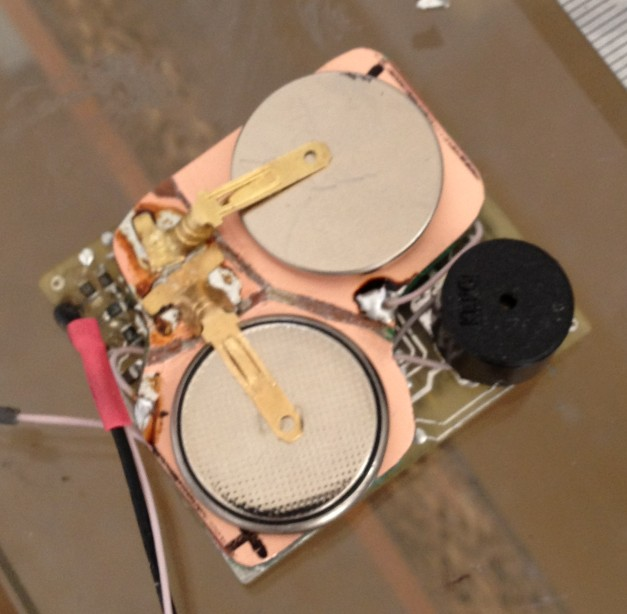
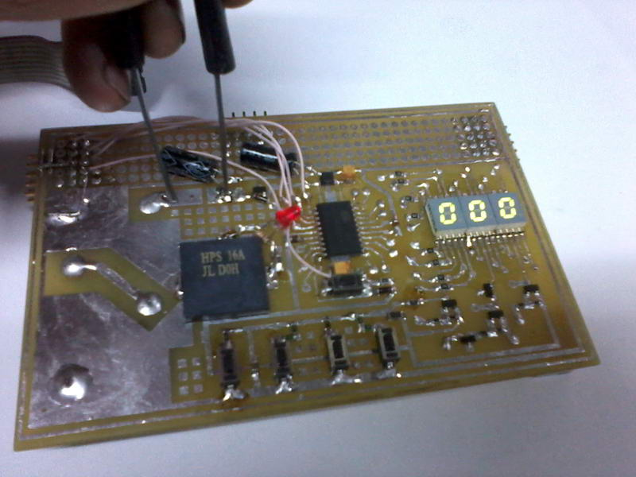
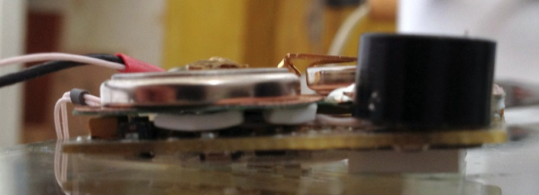

# Baby Bath Monitor

A small battery-powered device that watches the water in a baby bath: it measures the water temperature, detects the water level, and sounds an alarm when something is wrong.

I built it when my daughter was born and kept refining it for almost two years afterwards. It is a complete embedded project done end to end: my own schematic and PCB, a hand-assembled board, and firmware written entirely in **AVR assembly**.

<p align="center">
  
  
</p>

## Features

- **Water temperature** from 0 to 110 °C with 0.1 °C resolution, displayed in °C or °F
- **Upper and lower temperature alarms** with an adjustable pre-warning zone (a warning tone before the continuous alarm)
- **Water-level detection** with a conductive sensor, adjustable sensitivity, and a sensor self-test at power-up (short circuit, open circuit, wet electrodes)
- **Different tones for different alarms**, so you can tell what is wrong without looking at the display; alarms can be muted for 30 s
- **Designed for long battery life on two CR2032 cells**: the display switches off automatically, and the MCU sleeps in power-down mode, waking once per second to check the sensors
- **Low-battery warning**; settings are saved to EEPROM only when the battery can safely complete the write
- **User and service menus** on a 3-digit LED display, with sensor calibration done on the device itself

## Hardware

| | |
|---|---|
| MCU | ATtiny861A @ 8 MHz (internal RC) |
| Temperature sensor | LM35DZ on a cable probe |
| Power | 2 × CR2032 → NCP583 3.3 V LDO |
| Display | 3-digit multiplexed 7-segment LED |
| Input | 4 buttons read through a single ADC pin (resistor ladder) |
| CAD | P-CAD 2006 (schematic also exported to PDF) |

<p align="center">
  <a href="hardware/schematic.pdf"></a>
</p>

### Hardware highlights

- **The display drivers double as power switches.** The MOSFET that lights digit 1 also powers the keyboard divider, and the one that lights digit 2 powers the LM35 and the battery-sense divider. The firmware scheduler reads each of them right after the matching digit, so these circuits draw current only while their digit is lit, and they need no extra MCU pins.
- **One analog pin handles the keyboard, battery sense and wake-up.** Four buttons on a 1 % resistor ladder, a battery divider, and a zero-standby-current bias that lets a key press wake the MCU from power-down through INT1.
- **A loud buzzer from coin cells.** A micropower comparator drives the piezo in a bridge from the battery rail (about twice the supply voltage peak to peak). The driver powers itself up from the tone signal and switches off when the tone stops.
- **A high-impedance water sensor** (MΩ range) with self-diagnostics for short circuit, open circuit and wet electrodes.

## Firmware highlights

The firmware is about 5 000 lines of hand-written AVR assembly with no libraries (5.6 KB of the 8 KB flash):

- **Interrupt-driven design.** A Timer0-based round-robin scheduler dispatches tasks through a jump table (`IJMP`); the main loop only starts ADC conversions and puts the MCU to sleep.
- **One ADC shared by four signals** (temperature, battery, water, keyboard). The channel sequence is driven from the ADC interrupt, with different voltage references per channel and noise-reduction sleep during temperature sampling.
- **Fixed-point maths without a divider**: a 16 × 16 multiply for ADC-to-millivolt conversion, then decimal and Fahrenheit conversion using shifts and repeated subtraction.
- **A table-driven menu engine**: each menu item is described as a sequence of micro-steps in flash rather than as hand-written branching code.
- **Power management** with the watchdog in interrupt mode, clock gating through PRR, BOD disabled during sleep, and display pins switched to inputs while sleeping.

The details are in the [technical documentation](docs/TECHNICAL.md).

## Repository structure

```
├── firmware/
│   ├── tempsens0.asm        AVR assembly source (UTF-8)
│   ├── mem_map.inc          SRAM variable map
│   └── tn861Adef.inc        ATtiny861A definitions (Atmel)
├── hardware/
│   ├── schematic.pdf        Schematic + BOM (PDF)
│   ├── schematic.sch        P-CAD 2006 schematic
│   └── pcb.pcb              P-CAD 2006 PCB layout
└── docs/
    ├── USER_MANUAL.md       User manual (English)
    ├── TECHNICAL.md         Hardware and firmware documentation
    ├── user_manual_ru.doc   Original user manual (Russian)
    └── images/              Photos of the prototype and the final device
```

## Building

```
avrasm2 -fI -o tempsens0.hex tempsens0.asm      # Atmel Studio toolchain
avrdude -c usbasp -p t861 -U flash:w:tempsens0.hex:i -U eeprom:w:tempsens0.eep:i
```

The code also builds with the open-source AVRA after three small syntax tweaks. Build notes, fuses and the EEPROM map are in the [technical documentation](docs/TECHNICAL.md#4-building-and-flashing).

## Development history

| | |
|---|---|
| Dec 2011 | Prototype on a development board (see `docs/images/prototype_*.jpg`) |
| 2012 | Compact final PCB with a stacked two-cell holder; first user manual |
| Oct 2012 – Sep 2013 | Pre-alarm zone, alarm muting, on-device calibration, adjustable display timeout, alarm hold time |

<p align="center">
  
</p>

## Documentation

- [User manual](docs/USER_MANUAL.md)
- [Technical documentation](docs/TECHNICAL.md)

## License

MIT for the firmware and CERN-OHL for the hardware.
