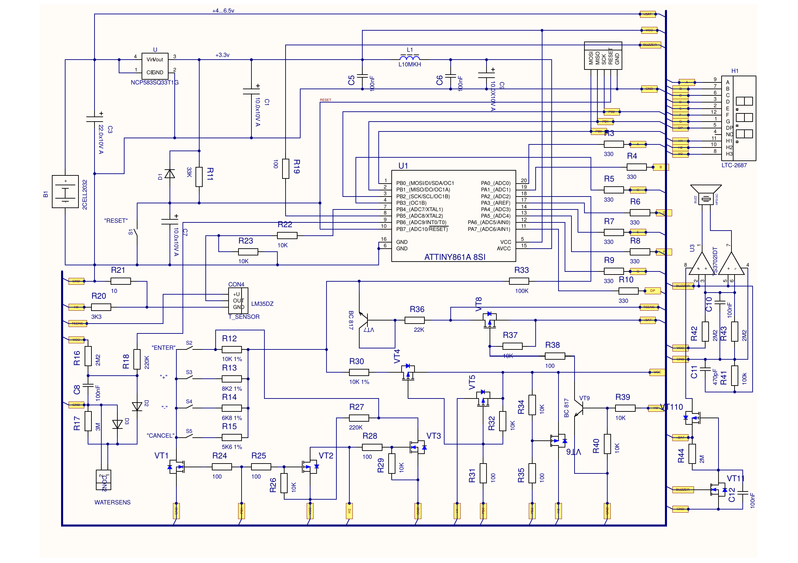

# Baby Bath Monitor — Technical Documentation

This document describes the hardware and firmware of the device, based on the schematic (`hardware/schematic.pdf`) and the assembly source (`firmware/tempsens0.asm`).

## 1. Overview

| Parameter | Value |
|---|---|
| MCU | Atmel **ATtiny861A** (8 KB flash, 512 B SRAM, 512 B EEPROM), SOIC-20. The PCB footprint is ATtiny461A/861A (pin-compatible). |
| Clock | Internal RC oscillator, 8 MHz (factory OSCCAL overridden with `0x7E`) |
| Power | 2 × CR2032 in series (≈ 6 V nominal) → NCP583 3.3 V LDO |
| Temperature sensor | LM35DZ (10 mV/°C) on a cable probe, powered from the battery only while it is being measured |
| Water sensor | Conductive two-electrode sensor |
| Display | 3-digit 7-segment LED (LTC-2687 in the schematic library), multiplexed |
| Input | 4 buttons on a single analog pin (resistor ladder) + RESET |
| Output | Piezo buzzer, bridge-driven by a TS3702 comparator from the battery rail |
| Firmware | 100 % AVR assembly, ~5 000 lines, no external libraries; 5 636 bytes of flash (69 %), 13 bytes of EEPROM |
| Development period | December 2011 – September 2013 |

Measurement range: 0…110 °C (limited by the 1.1 V ADC reference and the LM35's 10 mV/°C), displayed resolution 0.1 °C.

## 2. Hardware

The full schematic is in [`hardware/schematic.pdf`](../hardware/schematic.pdf) (exported from Altium; page 2 is the BOM).



### 2.1 Pin assignment

| Pin | Net | Function |
|---|---|---|
| PA0, PA1, PA3–PA7 | A, B, D, E, F, G, DP | Display segments through 330 Ω (R3–R10), active-low |
| PB3 | C | Segment **c** (moved here because PA2 is used by the keyboard) |
| PB0 | PB0 / MOSI | Digit 1 driver (VT5) **and** keyboard ladder supply (VT4) |
| PB1 | PB1 / MISO | Digit 2 driver (VT2) **and** switch common (VT1) |
| PB2 | PB2 / SCK | Digit 3 driver (VT6) |
| PA2 (ADC2 / INT1) | — | Keyboard, battery voltage and wake-up, through R33 100 kΩ |
| PB4 (ADC7) | — | LM35 output through R22 10 kΩ |
| PB5 (ADC8) | BUZZER | Buzzer driver input through R19 100 Ω |
| PB6 (ADC9) | — | Water sensor through R18 220 kΩ |
| PB7 | RESET | Reset: R11 33 kΩ, D1, C7, button S1 |

The ISP connector (CON1: MOSI, MISO, SCK, RESET, GND) shares PB0–PB2 with the display drivers. Because the resistors in series with the gates isolate them, the board can be reprogrammed in circuit.

### 2.2 Power supply

- **+BAT (4…6.5 V)**: two CR2032 cells in series (B1), buffered by C3.
- **+3.3 V**: NCP583 LDO (U, enable tied to the input, so it is always on), C1 on the output.
- **VCC / AVCC**: +3.3 V filtered by the LC network L1 (10 µH) with C5, C6 and C9, for the ADC.

Two loads run from the battery rail instead of 3.3 V: the LM35, which needs at least 4 V, and the buzzer driver, which gets a louder output from the higher voltage. Both are switched on only when needed (see below).

### 2.3 Display drivers double as power switches

The three P-MOSFET digit drivers (VT5, VT2, VT6) do more than drive the display. Their gate and drain signals also power other parts of the circuit, and the Timer0 task order in the firmware is arranged to match:

| Scheduler slot | Also powered during this slot | Used by the task that follows |
|---|---|---|
| `led_h1` (PB0 low) | VT4 connects the keyboard ladder pull-up R30 to VCC | `key_scan` |
| `led_h2` (PB1 low, H2 high) | VT9 switches on VT8, which powers the LM35 from +BAT; VT3 enables the battery divider | `tem_scan` → battery measurement |
| `led_h3` (PB2 low) | — | — |

In other words, the keyboard and the temperature sensor draw current only during their own time slot, and no extra MCU pins are needed to switch them.

### 2.4 Keyboard, battery sense and wake-up on one pin (PA2)

**Keyboard.** The four buttons (S2–S5) pull a common node low through 10 k / 8.2 k / 6.8 k / 5.6 k (1 %). The switch common is grounded by VT1 whenever PB1 is high. During slot 1, R30 (10 kΩ 1 %) pulls the node up to VCC, so each button produces a ratiometric voltage. The firmware thresholds match the calculated divider ratios:

| Button | Divider | Expected ADCH | Firmware threshold |
|---|---|---|---|
| ENTER | 10k / (10k + 10k) = 0.50 | `0x80` | ≥ `0x7D` |
| + | 8.2k / 18.2k = 0.45 | `0x73` | ≥ `0x71` |
| − | 6.8k / 16.8k = 0.40 | `0x67` | ≥ `0x65` |
| CANCEL | 5.6k / 15.6k = 0.36 | `0x5C` | ≥ `0x5C` |
| none | — | saturated | ≥ `0x95` |

**Battery sense.** The keyboard node is also fed from +BAT through R36 (22 kΩ) and VT7, a BC817 connected as a diode. During slot 2, VT3 grounds the ENTER leg, forming the divider (V<sub>BAT</sub> − V<sub>BE</sub>) · R12 / (R36 + R12). This is measured against the internal 2.56 V reference. The firmware threshold `0x6D` (≈ 1.09 V) corresponds to V<sub>BAT</sub> ≈ 4.1 V.

**Wake-up.** In power-down mode all MCU pins are inputs, and R26 keeps VT1 on. The node is biased from the battery through R36 and VT7, so it draws no static current. Pressing any button pulls PA2 (INT1) low and wakes the MCU.

### 2.5 Temperature sensor

The LM35DZ (connector CON4, on a cable probe) is powered from +BAT through the P-MOSFET VT8 (net TSENS). VT8 is switched on by VT9 while digit 2 is active. The output reaches PB4 through R22 (10 kΩ series resistor); R23 (10 kΩ) is the output load.

The sensor's ground pin is raised slightly above circuit ground by R20 (3.3 kΩ, from H2) and R21 (10 Ω): 3.3 V · 10 / 3310 ≈ 10 mV. This keeps the output in its linear range near 0 °C. The firmware removes this offset with the factory zero offset stored in EEPROM (`0x03` = 10 ADC counts ≈ 10.8 mV at the 1.1 V reference).

### 2.6 Water-level sensor

This is a two-electrode conductive sensor (CON2). One electrode is grounded. The other connects through D2 to a node pulled up to VCC by R16 (2.2 MΩ), filtered by C8 (100 nF) and read by PB6 through R18 (220 kΩ). R17 (3 MΩ) and D3 on the electrode side set the "dry" level and clamp the input.

With the 2.56 V reference, the self-test classifies the reading as follows:

| ADCH | Voltage | Result |
|---|---|---|
| < 100 | < 1.0 V | Electrodes short-circuited |
| 100…200 | 1.0…2.0 V | Wet (water between the electrodes) |
| 201…220 | 2.0…2.2 V | OK (dry) |
| ≥ 221 | ≥ 2.2 V | Open circuit |

During operation the alarm threshold is `100 + SEn`, so higher sensitivity triggers at a smaller drop in resistance. The very high resistor values keep the standby current through the sensor under 1 µA.

### 2.7 Buzzer driver

The piezo buzzer is driven in a bridge configuration by the TS3702 dual comparator (U3):

- The PB5 square wave (net BUZZER, filtered by R19/C11, pulled down by R41) goes to the inverting input of one comparator and the non-inverting input of the other.
- The other inputs are tied to VCC/2 (R42/R43, 2.2 MΩ each, C10).
- The two outputs drive the buzzer terminals in antiphase, so the piezo sees roughly twice the supply voltage peak to peak.
- The comparator is powered from **+BAT** through the P-MOSFET VT110. The first high half-period on BUZZER turns on VT11, which discharges C12 and switches VT110 on. R44 (2 MΩ) and C12 keep it on between cycles (τ ≈ 0.2 s). When the tone stops, the driver turns itself off.

This is why the firmware can enable or silence the buzzer simply by changing the direction of PB5 (DDRB5): as an input, PB5 is pulled low by R41 and the whole driver loses power.

### 2.8 Bill of materials

| Ref | Part | Package | Qty |
|---|---|---|---|
| U1 | ATtiny861A | SOIC-20 (footprint ATTINY461A-8SI) | 1 |
| U | NCP583SQ33T1G, 3.3 V LDO | SC-82AB | 1 |
| U3 | TS3702IDT, dual micropower comparator | SO-8 | 1 |
| — | LM35DZ temperature sensor (on cable, CON4) | TO-92 | 1 |
| H1 | LTC-2687, 3-digit 7-segment LED | — | 1 |
| BUZZ | HPS13C piezo buzzer | — | 1 |
| B1 | 2 × CR2032 holder | — | 1 |
| VT1, VT3, VT11 | N-channel MOSFET | SOT-23 | 3 |
| VT2, VT4, VT5, VT6, VT8, VT110 | P-channel MOSFET | SOT-23 | 6 |
| VT7, VT9 | BC817 NPN | SOT-23 | 2 |
| D1–D3 | BAS16 | SOT-23 | 3 |
| L1 | 10 µH (L10MKH) | 1208 | 1 |
| C1, C3, C7, C9 | Tantalum, 10–22 µF / 10 V | 1206 | 4 |
| C5, C6, C8, C10, C11, C12 | Ceramic, 100 nF / 470 pF | 0805 | 6 |
| R3–R44 | Resistors | 0805 | 42 |
| S1–S5 | IT-1185AU tactile switch | — | 5 |
| CON1, CON2, CON4 | ISP (5-pin), water sensor (2-pin), temperature sensor (3-pin) | — | 3 |

### 2.9 Design files

| File | Contents |
|---|---|
| `hardware/schematic.pdf` | Schematic and BOM (PDF) |
| `hardware/schematic.sch` | Schematic, P-CAD 2006 (binary) |
| `hardware/pcb.pcb` | PCB layout, P-CAD 2006 (binary) |

> **Note.** The PCB footprint is named ATtiny461A, which has the same pinout. The firmware is 5.6 KB, however, so it fits only the **ATtiny861A** (8 KB); the 461A has 4 KB of flash.

## 3. Firmware architecture

### 3.1 Overview

The firmware is fully interrupt-driven. The main loop only decides when to start an ADC conversion and when to go to sleep; all real work happens in interrupt handlers:

| Interrupt | Role |
|---|---|
| **Timer0 overflow** | Cooperative task scheduler: display multiplexing, keyboard, menu, timers |
| **Timer1 overflow** | Buzzer tone generation; temperature conversion math |
| **ADC complete** | Processes the result for the current channel and selects the next one |
| **Watchdog** (interrupt mode, 1 s) | Once-per-second alarm evaluation; wakes the MCU from sleep |
| **INT1** | Wake-up on key press |

### 3.2 Task scheduler (Timer0)

Each Timer0 overflow executes exactly one task from a 14-entry jump table (`t0_table`), dispatched with `IJMP`:

```
led_h1 → key_scan → dp_blink → menu → led_h3 → power_off → key_timeout → timer_1sec
→ display → led_h2 → temp_scan → water_scan → beep_timer → reset
```

This gives a round-robin loop with a fixed time slot per task. The three `led_hX` tasks multiplex the display (one digit per slot), which keeps display timing stable no matter what the other tasks do. With the display on, the tick rate is about 3.25 kHz, which gives a refresh rate of about 230 Hz.

Right after power-up the Timer0 handler runs a ~3 s self-test sequence before handing control to the scheduler: it detects the service-menu key combination, powers the water sensor, measures it and classifies the result.

### 3.3 ADC channel sequencing

One ADC is shared between four signals. Every conversion-complete interrupt chooses the next channel, forming a chain:

| Stage | ADMUX | Reference | Channel | Processing |
|---|---|---|---|---|
| Temperature | `0x87` | 1.1 V | ADC7 (PB4) | 4 samples accumulated; ADC noise-reduction sleep; the display is turned off during conversion |
| Battery | `0xA2` + REFS2 | 2.56 V | ADC2 (PA2) | ADCH compared to `0x6D` |
| Water | `0xA9` + REFS2 | 2.56 V | ADC9 (PB6) | ADCH stored in `code_waterhi` |
| Keyboard | `0x22` | VCC | ADC2 (PA2) | Decoded as in 2.3, with debounce and auto-repeat |

### 3.4 Temperature pipeline

1. Four 10-bit samples are summed. A zero offset `corr0_temp` (factory offset ± user `Cr0`) is subtracted from each sample.
2. The sum is multiplied by the reference voltage in millivolts (`const_v_ref`, factory 1105 mV ± user `CrA`) using a 16 × 16-bit unsigned multiply (the Atmel AVR200 `mpy16u` routine).
3. Dividing by 4 (averaging) and by 1024 (ADC full scale) — done with shifts and byte selection — gives millivolts.
4. Because the LM35 outputs 10 mV/°C, millivolts are converted to whole degrees and tenths by repeated subtraction (no division instruction on AVR).
5. Fahrenheit is computed from °C × 9 / 5 + 32 with rounding, again using shift-and-add and subtraction only.
6. The digits are mapped to segment patterns through a lookup table (`sym_table`) that also contains the letters used by the menu: `H I L E F n r C h A o n -`.

### 3.5 Alarm logic

Alarms are evaluated in the watchdog ISR once per second, in priority order:

1. **Water level.** If enabled (`water_sel = 3`) and `code_waterhi < sensitivity + 100`, the device plays a 1 kHz intermittent tone.
2. **High temperature.** Uses `HI` and the signed pre-alarm offset `SI`:
   - `SI ≥ 0`: continuous 1.5 kHz at `T ≥ HI + SI`, intermittent at `HI ≤ T < HI + SI`.
   - `SI < 0`: continuous at `T ≥ HI`, intermittent at `HI − |SI| ≤ T < HI`.
3. **Low temperature.** Mirrors the high-temperature logic with 600 Hz tones; tenths are rounded up before comparison.
4. **Alarm hold (`ALr`).** When a condition clears, the last alarm keeps sounding for `ALr` seconds, so a brief return to normal does not silence it.
5. **Low battery.** Short beeps at about 2 kHz.

Tone frequency is set by Timer1's reload value: *f = 125 kHz / (2 × (256 − reload))*. For example, `0xD5` gives 1.45 kHz, `0xC0` gives 977 Hz and `0x95` gives 584 Hz.

**Mute.** CANCEL pressed outside the menu resets the `beep_pause` counter; for the next 30 watchdog ticks (~30 s) alarm routines skip enabling the buzzer.

### 3.6 Menu engine

The menu is a table-driven state machine. `menu_step` indexes the jump table `menu_t1`, in which every menu item is described as a sequence of micro-steps:

```
show label → start 1 s timer → wait → copy value to edit buffer → show value
→ wait for key → save value → blank → start 1 s timer → wait → next item
```

ENTER, +, − and CANCEL move `menu_step` forward or back or edit the buffer. The user menu (`HI`, `LO`, `SI`, `SE`) and the service menu (`SEn`, `Cr0`, `CrA`, `Con`, `ALr`) live in the same table; the service part is reached by jumping directly to its index (`0x2F`) at power-up.

### 3.7 Power management

| State | Description |
|---|---|
| **Active** | Display on; scheduler running at full rate |
| **Monitoring** | Display off after the timeout (`Con`). The MCU spends most of its time in *power-down* sleep with BOD disabled and Timer0/Timer1/ADC/USI clocks gated through PRR. The watchdog interrupt wakes it every second to measure and evaluate alarms. |
| **Off** | Entered by holding CANCEL. Settings are written to EEPROM, the watchdog is stopped, and only INT1 (a key press) can wake the device. |

Before sleep, all display pins are made inputs, so no current flows through the LEDs.

### 3.8 EEPROM map

| Address | Contents | Default |
|---|---|---|
| `0x00`–`0x01` | ADC reference voltage, mV (hi, lo) | `0x0451` = 1105 mV |
| `0x02` | Water sensor sensitivity (`SEn`) | 40 |
| `0x03` | Factory ADC zero offset | 10 |
| `0x04` | Water alarm enable (2 = off, 3 = on) | 3 |
| `0x05` | Upper temperature limit (`HI`) | 40 |
| `0x06` | Lower temperature limit (`LO`) | 0 (off) |
| `0x07` | Pre-alarm offset (`SI`), signed | 0 |
| `0x08` | User offset correction (`Cr0`), signed | 0 |
| `0x09` | User reference correction (`CrA`), signed | 0 |
| `0x0A`–`0x0B` | Display timeout, s (lo, hi) | 5 |
| `0x0C` | Alarm hold time (`ALr`), s | 0 |

The EEPROM is written only when the device is switched off with CANCEL and the battery is above the low-voltage threshold. After a reset, `HI`, `LO` and `SE` are forced back to their defaults, while calibration values are kept.

## 4. Building and flashing

Everything needed to build is in `firmware/`:

| File | Description |
|---|---|
| `tempsens0.asm` | Main source |
| `mem_map.inc` | SRAM variable map |
| `tn861Adef.inc` | ATtiny861A register definitions (Atmel AVR000, shipped with Atmel Studio) |

**Atmel Studio / AVR Studio (avrasm2)**, the original toolchain:

```
avrasm2 -fI -o tempsens0.hex -l tempsens0.lst tempsens0.asm
```

**AVRA** (open-source, Linux/macOS). AVRA is not fully compatible with avrasm2 syntax, so three small changes are needed on a copy of the source:

1. Turn the C-style header comment `/* ... */` (lines 1–6) into `;` comments.
2. Comment out `.device ATtiny861A`, because `tn861Adef.inc` already declares the device.
3. Remove the space in `start_test :` so it reads `start_test:`.

```
avra tempsens0.asm
# Code: 2818 words (5636 bytes), EEPROM: 13 bytes
```

The warnings about registers "already assigned" are expected: several `.def` aliases intentionally share registers.

**Flashing** over ISP (CON1), for example with avrdude. The EEPROM image is `tempsens0.eep` with avrasm2 or `tempsens0.eep.hex` with AVRA:

```
avrdude -c usbasp -p t861 -U flash:w:tempsens0.hex:i -U eeprom:w:tempsens0.eep.hex:i
```

Always write the EEPROM image too. It contains the factory calibration (reference voltage and zero offset) and the default settings. After flashing, fine-tune the reading against a reference thermometer using `Cr0` and `CrA` in the service menu.

**Fuses:** internal 8 MHz RC oscillator. The firmware turns off the ÷8 clock prescaler itself through CLKPR, so CKDIV8 can be left at its default. Keep RSTDISBL unprogrammed, otherwise ISP access is lost.

The original comments were written in Russian (Windows-1251). In this repository the source has been converted to UTF-8 so that it displays correctly on GitHub.

## 5. Known issues and notes

- **`CrA = +15` is read as −15.** When the correction is applied, values `0x00`–`0x0E` are treated as positive, while the menu allows up to `0x0F`. The practical range is therefore −15…+14. `Cr0` (±10) is not affected.
- **The PCB footprint is named ATtiny461A**, but the firmware needs the 8 KB ATtiny861A.
- Error codes 1 and 3 of the water sensor self-test are swapped in the original Russian manual compared with the firmware; the English manual follows the firmware.
- The original manual gives 2.5 kHz for the low-battery tone; the reload value in the code (`0xE0`) corresponds to about 2 kHz.
